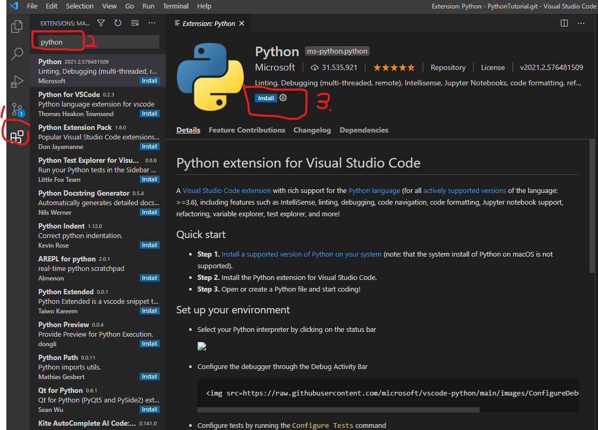

# Python简易教程

## Why Python？

## 优势

## 学习环境

### 安装Python 

两种方式安装：

1. 官网下载Python直接安装

    使用pip进行包管理
        
    使用virtualenv进行开发、运行环境管理

2. 使用Anaconda进行安装

    包含包管理器conda

    包含Python开发、运行环境管理

    可以在 [清华大学开源软件镜像站(ANACONDA)](https://mirrors.tuna.tsinghua.edu.cn/help/anaconda/) 进行下载。

**建议使用Anaconda进行安装**

### 安装VisualStudio Code

安装完成后安装扩展模块Python，参见下图。

